I build AI agents and the backend systems that keep them reliable. The work I'm proudest of is merged into codebases I don't own — the OpenAI Agents SDK, a real-time global intelligence platform, and one of the most widely used PSP emulators.

  &nbsp;
  &nbsp;
  

 

<picture>
  <source media="(prefers-color-scheme: dark)" srcset="assets/section-upstream-dark.svg">
  
</picture>

**[openai/openai-agents-python](https://github.com/openai/openai-agents-python)** — voice pipeline reliability 
Streamed float32 audio was reaching a PCM16 realtime transcription endpoint as raw IEEE-754 bytes. Shipped a shared, non-mutating conversion path with regression tests covering clipping, exact byte output, int16 pass-through, and buffer immutability. → [PR #3916](https://github.com/openai/openai-agents-python/pull/3916)

**[koala73/worldmonitor](https://github.com/koala73/worldmonitor)** — 17 merged pull requests 
Real-time global intelligence dashboard. Localized MapLibre basemap labels into 20 languages including RTL, isolated request caches by query variant, and shipped an ocean-and-ice data pipeline from ingestion through RPC and cache health. → [all merged PRs](https://github.com/koala73/worldmonitor/pulls?q=is%3Apr+author%3AFayezBast+is%3Amerged)

**[hrydgard/ppsspp](https://github.com/hrydgard/ppsspp)** — Arabic localization, completed 
Translated the ~380 remaining UI strings, repaired four broken placeholder substitutions, and brought the Arabic key set fully in sync with the English source. → [PR #21913](https://github.com/hrydgard/ppsspp/pull/21913)

<picture>
  <source media="(prefers-color-scheme: dark)" srcset="assets/section-building-dark.svg">
  
</picture>

| project | what it is | built with |
|:--|:--|:--|
| **[B-eats](https://github.com/FayezBast/Uber-Eats-Clone)** | Delivery platform in three apps — a customer/driver/restaurant frontend, an ops dashboard, and a Go API owning auth, delivery lifecycle, notifications, and live tracking | `Go` `Next.js` `PostgreSQL` `Redis` |
| **Basira** | Voice-first mobile assistant for blind users in Lebanon — scene understanding, spatial audio cues, Arabic-first TTS | `Swift` `ARKit` `FastAPI` `Groq` |
| **[Jarvis 2.0](https://github.com/FayezBast/Jarvis-2.0)** | Local tool-using agent — sandboxed file operations, shell and git workflows, persistent memory | `Python` `Gemini` |
| **[Pulse AI](https://github.com/FayezBast/Pulse-Ai---Hackathon)** | Hospital workflow prototype — spoken clinical notes to automated DXCare form entry | `Python` `Speech` |

<picture>
  <source media="(prefers-color-scheme: dark)" srcset="assets/section-stack-dark.svg">
  
</picture>

**languages** — Go · Python · TypeScript · Swift 
**backend** — FastAPI · Gin · PostgreSQL · Redis · Docker 
**frontend** — Next.js · React · SwiftUI 
**ai** — agents · tool use · RAG · evals — OpenAI · Gemini · Groq

 

